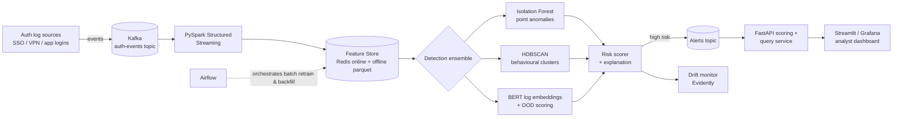

# Sentinel-IAM — Real-Time Identity Anomaly Detection Platform

[](https://github.com/VenkateswarluNagineni/sentinel-iam/actions/workflows/ci.yml)
[](https://www.python.org/downloads/)
[](LICENSE)
[](https://github.com/astral-sh/ruff)

Streaming platform that scores **Identity & Access Management (IAM) auth logs in near
real-time** and flags anomalous / out-of-distribution behaviour before an analyst would
ever notice it manually. Built to mirror production SOC pipelines: high-volume ingest,
online feature computation, unsupervised + embedding-based detection, and drift-aware
model monitoring.

> Why it exists: most "anomaly detection" portfolios stop at a static classifier on a
> Kaggle CSV. Sentinel treats anomaly detection as a *streaming systems* problem —
> bounded latency, stateful features, model drift, and explainable alerts.

## Architecture



## Capabilities (target state)

| Area | What it does |
|------|--------------|
| **Ingestion** | Kafka topic of normalized auth events; replayable, schema-validated |
| **Streaming features** | Per-user/per-IP rolling features (login velocity, geo-velocity, rare-resource access) via Spark Structured Streaming |
| **Detection** | Ensemble: Isolation Forest (point) + HDBSCAN (behavioural clusters) + BERT embeddings with out-of-distribution scoring |
| **Explainability** | Each alert ships top contributing features + nearest normal cluster |
| **Monitoring** | Evidently data/concept-drift reports; alert when feature distributions shift |
| **Serving** | FastAPI scoring endpoint + analyst query API |
| **Ops** | Dockerized stack, Airflow retrain DAG, GitHub Actions CI |

## Tech stack

`Python 3.11` · `Kafka` · `PySpark Structured Streaming` · `Redis` · `scikit-learn`
`HDBSCAN` · `transformers (BERT)` · `Evidently` · `FastAPI` · `Airflow` · `Docker Compose`

## Status

🚧 Built in public, in phases — see **[ROADMAP.md](ROADMAP.md)**. Each phase ships
working, tested code plus a short design note in [`docs/`](docs/).

## Quickstart

```bash
git clone https://github.com/VenkateswarluNagineni/sentinel-iam
cd sentinel-iam
pip install -e ".[dev]"
pytest
```

## License

MIT © Venkateswarlu Nagineni
